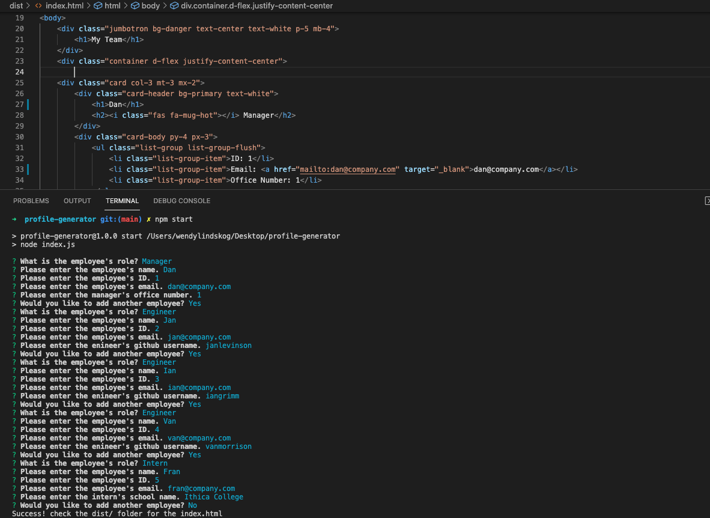
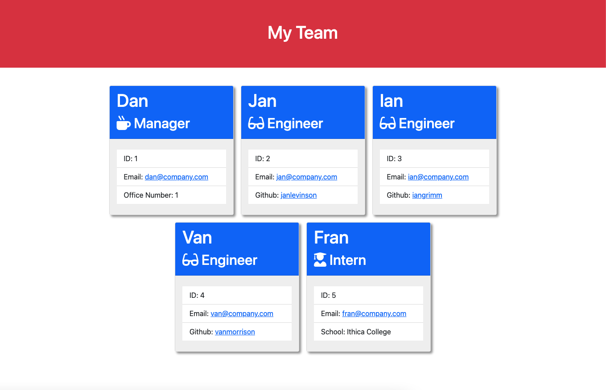

# README Generator

## Description

- User can generate an html document that display team profiles
- User can add as many employees as they wish through console prompts
- HTML document will be overwritten every time user run the program in the console

## Table of Contents

- [Installation](#installation)
- [Usage](#usage)
- [Credits](#credits)
- [License](#license)

## Installation

Open console:

If package.json file is present then type the command: `npm install`

_If no package.json file is present, type the command: `npm init` ,then: `npm install inquirer jest`_

Below is video demonstrating the My Team page generation process:

https://drive.google.com/file/d/1So6z9Bp1IOuUdjggpfcx4K12_cwNZtpi/view?usp=sharing

## Usage

Once installation is complete run: `npm start` or `node index.js`

## Credits

https://gist.github.com/lukas-h/2a5d00690736b4c3a7ba - info on license badges

https://coding-boot-camp.github.io/full-stack/github/professional-readme-guide - helped with the README guidelines

https://getbootstrap.com/docs/5.0/getting-started/introduction/ - this application uses bootstrap

https://www.npmjs.com/

https://developer.mozilla.org/en-US/docs/Web

https://www.w3schools.com/

https://nodejs.org/en/docs/

https://jestjs.io/

## License

MIT License

Copyright (c) 2021 Mark Lindskog

Permission is hereby granted, free of charge, to any person obtaining a copy
of this software and associated documentation files (the "Software"), to deal
in the Software without restriction, including without limitation the rights
to use, copy, modify, merge, publish, distribute, sublicense, and/or sell
copies of the Software, and to permit persons to whom the Software is
furnished to do so, subject to the following conditions:

The above copyright notice and this permission notice shall be included in all
copies or substantial portions of the Software.

THE SOFTWARE IS PROVIDED "AS IS", WITHOUT WARRANTY OF ANY KIND, EXPRESS OR
IMPLIED, INCLUDING BUT NOT LIMITED TO THE WARRANTIES OF MERCHANTABILITY,
FITNESS FOR A PARTICULAR PURPOSE AND NONINFRINGEMENT. IN NO EVENT SHALL THE
AUTHORS OR COPYRIGHT HOLDERS BE LIABLE FOR ANY CLAIM, DAMAGES OR OTHER
LIABILITY, WHETHER IN AN ACTION OF CONTRACT, TORT OR OTHERWISE, ARISING FROM,
OUT OF OR IN CONNECTION WITH THE SOFTWARE OR THE USE OR OTHER DEALINGS IN THE
SOFTWARE.

## Features

- prompts will ask questions to help gcreate each emplyee profile
- File will be generated/ overwritten if one already exists in dist/ folder
- Links to github and email will be present (if email address and github profile name are vaild)
